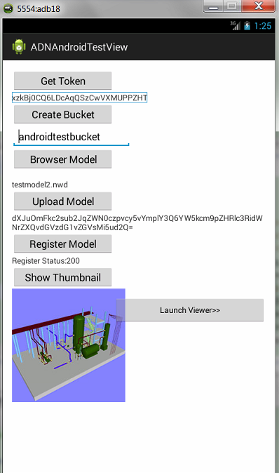

#Autodesk View and Data API workflow sample for Android

##Description

This is a sample for Android devices demoing workflow of using Autodesk View and Data API:

* Get token and set token
* Create bucket
* Upload model
* Start translation (registration)
* Get thumbnail of model
* Display model in the browser

##Dependencies

* Make sure the necessary *.jar in libs are available, which are already included in the project.
* Make sure to provide test models in res\raw before building the app. The package in this repository has provided a model called testmodel.nwd. These files will be copied to the storage of the mobile at <SD card root>/ADNAndroidTestView when the app is being launched. 

##Setup/Usage Instructions

* Download and install Eclipse and [Android Development Tool-kit](http://developer.android.com/sdk/installing/installing-adt.html#Configure);
* Download and install Android SDK API 18 or above from Android SDK Manager, this sample targets API 18.
* Import the source code from "existing Android code into Workspaces" in Eclipse by clicking file -> Import, browse to the project folder, make sure the "project to Import" appears, and click "finish" button to import the project. 
* Get your consumer key and secret key from http://developer.autodesk.com
* Set the API keys in \src\main\Credentials.java
* Build the project to generate the *.apk, deploy the *.apk to a mobile device. 
* If you prefer to use an emulator, you can create any Android virtual device from Android Virtual Device Manager, please be sure to use API level 18 or above and choose a device with bigger screen.
* Open the App on android device or emulator, click [Get Token] >> token should appear in the text box below
* Input bucket name in text box under [create bucket], click [Create Bucket] >> wait for the success info. The bucket key (i.e. bucket name) must match “^[-_.a-z0-9]{3,128}$”. That is bucket must be between 3 to 128 characters long and contain only lower-case letters, numbers and the symbols . _ –.  And bucket keys must be unique within the data center or region in which they were created. Best practice is to incorporate your company name/domain name or the client Id into the bucket name. If you prefer to use the client Id(should convert to lower-case first) as part of bucket name, please note that it is the consumer key, not the secret key.  Please also pay attention to the length of the whole bucket name, which should be less than 128.
* Click [Browser Model] to show available test file list, choose one of them
* Click [Upload Model] to upload the model file, the URN appears in the text box below once file is uploaded.
* Click [Register Model] to register the model for translation, status shows up in text box below, it says "Register Status: 200" if everything is OK.
* Click [Show thumbnail] to get the thumbnail and display it in the image box blow. You may see "get thumbnail failed" if translation is still not in progress, you can try again latter. 
* Click [Launch Viewer] to launch the viewer in a WebGL enabled browser. It is tested on Google Chrome for Android (version 38.0.2125.114), while you can try any browser that is WebGL compatible. If you have problems with this step, you can look into console of browser with USB debugging. If you are using emulator, you will see a blank web page as the browser in emulator does not support WebGL.
*[]
 
## License

This sample is licensed under the terms of the [MIT License](http://opensource.org/licenses/MIT). Please see the [LICENSE](LICENSE) file for full details.

##Written by 

Xiaodong Liang

